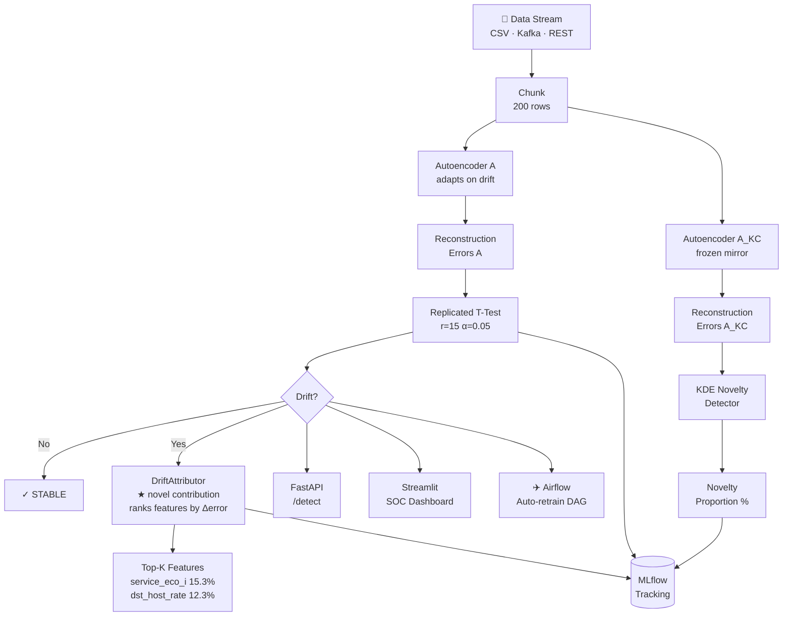

<div align="center">


<br/><br/>

# 🛡️ Vigil

### Production-ready unsupervised concept drift detection for network traffic streams

**No labels. No manual thresholds. Knows when your data changes — and tells you exactly which features changed.**

```bash
pip install vigil-drift
```

[Website](https://venkateswara-sahu.github.io/OWADD/) · [Quick Start](#-quick-start) · [Dashboard](#-live-dashboard) · [API](#-rest-api) · [Kafka](#-kafka-streaming) · [Airflow](#-airflow-mlops) · [Docker](#-docker) · [Paper](#-research-basis)

</div>

---

## The Problem

In production ML systems, the data your model was trained on eventually stops looking like the data it receives — **concept drift**. For network security, attacks evolve. Most drift detectors require labels (unavailable in real-time) or only tell you *that* drift happened, not *what* drifted.

**Vigil solves both.**

---

## What It Does

| Capability | How |
|---|---|
| 🔍 **Detect concept drift** | Replicated T-Test (r=15) on autoencoder reconstruction errors — no labels needed |
| 🆕 **Identify novel classes** | KDE density estimation on a frozen mirror autoencoder (A_KC) |
| 📊 **Explain the drift** | `DriftAttributor` ranks input features by reconstruction error delta |
| ⚡ **Serve at scale** | FastAPI REST service with `/fit` and `/detect` endpoints |
| 📡 **Stream-native** | Kafka producer/consumer pipeline — processes live network traffic chunks |
| 📈 **Track experiments** | MLflow logs every chunk's drift severity, novelty rate, and attribution report |
| ✈️ **Auto-retrain** | Airflow DAGs trigger retraining with a quality gate when drift accumulates |
| 🖥️ **Visualize live** | SOC-style Streamlit dashboard with real-time charts |

---

## Architecture



**Key design decisions (from arXiv:2605.29834):**
- 1-D reconstruction error proxy → memory complexity O(buffer\_size) not O(n × d)
- Dual autoencoders: **A** adapts on drift; **A_KC** stays frozen to distinguish *drift* from *novelty*
- Replicated T-tests (r=15) reduce variance vs. a single test

**Novel contribution (Vigil, not in the paper):**
- `DriftAttributor` — per-feature reconstruction error delta → ranks features by drift contribution → makes alerts *actionable*

---

## 📦 Quick Start

### Install from PyPI

```bash
pip install vigil-drift
```

### Or install from source (with all extras)

```bash
git clone https://github.com/Venkateswara-Sahu/OWADD.git
cd OWADD
python -m venv .venv
.venv\Scripts\activate        # Windows
# source .venv/bin/activate   # Linux/Mac
pip install -e ".[dev]"
```

### Basic usage

```python
from vigil import Vigil

v = Vigil(feature_names=feature_cols, top_k_features=5)

# Phase 1: train on baseline traffic (offline)
v.fit(baseline_data)

# Phase 2: detect on every incoming chunk
for chunk in stream:
    result = v.detect(chunk)

    if result.drift_detected:
        print(f"⚠  severity={result.drift_severity:.2f}")
        for feat in result.attribution.top_features:
            print(f"   {feat['feature_name']}: {feat['contribution']:.1%}")

# ⚠  severity=1.00
# → service_eco_i              15.3%   (port scan signature)
# → dst_host_same_src_port_rate 12.3%  (scanning pattern)
# → srv_diff_host_rate          11.1%  (lateral movement)
```

---

## 🖥️ Live Dashboard

SOC-style real-time monitoring of the NSL-KDD network traffic stream:

```bash
pip install "vigil-drift[dashboard]"
streamlit run dashboard/app.py
```

Open **http://localhost:8501**, press **▶ Start** and watch:
- Reconstruction error timeline update chunk by chunk
- Red ⚠ drift markers appear when traffic distribution shifts
- Feature attribution chart reveals which network features drifted
- Novelty gauge tracks unknown attack class emergence

---

## 🌐 REST API

FastAPI microservice for production deployment:

```bash
pip install "vigil-drift[api]"
uvicorn api.app:app --host 0.0.0.0 --port 8000 --reload
```

Open **http://localhost:8000/docs** for interactive Swagger UI.

```bash
# Train on initial traffic baseline
curl -X POST http://localhost:8000/fit \
  -H "Content-Type: application/json" \
  -d '{"data": [[0.1, 0.5, ...], ...]}'

# Detect drift in incoming batch
curl -X POST http://localhost:8000/detect \
  -H "Content-Type: application/json" \
  -d '{"data": [[0.3, 0.9, ...], ...]}'
```

**Response:**
```json
{
  "drift_detected": true,
  "drift_severity": 0.93,
  "novelty_proportion": 0.0,
  "top_drifted_features": [
    {"feature_name": "diff_srv_rate", "contribution": 0.23, "error_delta": 0.041},
    {"feature_name": "service_other", "contribution": 0.07, "error_delta": 0.012}
  ],
  "message": "⚠️ Concept drift detected (severity=0.93)"
}
```

---

## 📡 Kafka Streaming

Simulate a live network traffic stream with the Kafka pipeline:

```bash
# Start Kafka + Zookeeper
docker compose up kafka zookeeper -d

# Terminal 1 — publish 25 chunks from NSL-KDD
python kafka_pipeline/producer.py

# Terminal 2 — consume and detect drift in real-time
python kafka_pipeline/consumer.py
```

**Live output:**
```
[Consumer] Chunk 01 — TRAINING (200 samples, 4.0s)
[Consumer] Chunk 05 [normal    ] ✓ STABLE  | severity=0.00 | error=0.0049
[Consumer] Chunk 11 [ipsweep   ] ⚠ DRIFT   | severity=1.00 | error=0.0223
             → service_eco_i(15.3%), dst_host_same_src_port_rate(12.3%)
[Consumer] Chunk 24 [normal    ] ⚠ DRIFT   | severity=0.33 | error=0.0175
             → root_shell(27.7%), service_telnet(21.5%)
[Consumer] Done. Processed 25 chunks total.
```

---

## ✈️ Airflow MLOps

Two production DAGs automate the MLOps lifecycle:

| DAG | Schedule | What it does |
|---|---|---|
| `vigil_stream_monitor` | Hourly | Reads the latest traffic chunk, runs Vigil, logs to MLflow, triggers retraining if drift > threshold |
| `vigil_retrain` | Triggered | Retrains Vigil on recent data, evaluates against a quality gate, promotes if passing |

```bash
# Start Airflow
docker compose up airflow -d
# Open http://localhost:8080
```

---

## 🐳 Docker

Full stack — API, Dashboard, MLflow, Kafka, Zookeeper — one command:

```bash
docker compose up
```

| Service | URL |
|---|---|
| REST API | http://localhost:8000/docs |
| SOC Dashboard | http://localhost:8501 |
| MLflow UI | http://localhost:5000 |
| Kafka | localhost:9092 |

---

## 📊 MLflow Experiment Tracking

```bash
pip install "vigil-drift[mlflow]"

python -c "
from data.nsl_kdd_loader import load_nsl_kdd
from data.stream_simulator import StreamSimulator
from vigil import Vigil
from vigil.logging.mlflow_logger import MLflowLogger

X, y, feat = load_nsl_kdd()
sim = StreamSimulator(X, y)
v = Vigil(feature_names=feat)
logger = MLflowLogger(experiment_name='nsl-kdd-stream')

first = next(sim.stream(n_chunks=1))
v.fit(first.X, verbose=False)

logger.start_run(params={'buffer_size': 1000, 'drift_threshold': 0.3})
for chunk in sim.stream(n_chunks=25):
    result = v.detect(chunk.X)
    logger.log_chunk(result, ground_truth_label=chunk.dominant_class)
logger.end_run()
"

mlflow ui   # → http://localhost:5000
```

---

## 🧪 Tests

```bash
pytest tests/ -v --cov=vigil
```

```
tests/test_autoencoder.py::test_autoencoder_forward_shape          PASSED
tests/test_autoencoder.py::test_reconstruction_errors_non_negative PASSED
tests/test_autoencoder.py::test_mirrored_pair_identical_weights    PASSED
tests/test_autoencoder.py::test_training_reduces_loss              PASSED
tests/test_drift_detector.py::test_no_drift_during_warmup          PASSED
tests/test_drift_detector.py::test_no_false_drift_on_stable_stream PASSED
tests/test_drift_detector.py::test_drift_detected_on_shifted_dist  PASSED
tests/test_sentinel.py::test_sentinel_fit_and_detect               PASSED
tests/test_sentinel.py::test_sentinel_attribution_on_drift         PASSED
... 14 passed in 15s, 81% coverage
```

---

## 🗂️ Project Structure

```
OWADD/
├── vigil/                       # Core pip package — pip install vigil-drift
│   ├── core/
│   │   ├── autoencoder.py       # Dual mirrored autoencoders (A and A_KC)
│   │   ├── drift_detector.py    # Replicated T-Test drift detection
│   │   └── novelty_detector.py  # KDE-based novel class recognition
│   ├── logging/
│   │   └── mlflow_logger.py     # MLflow experiment tracking
│   ├── attribution.py           # Feature-level drift attribution (novel)
│   └── sentinel.py              # Main Vigil public API
│
├── api/                         # FastAPI REST service
├── dashboard/                   # SOC-style Streamlit dashboard
├── kafka_pipeline/              # Kafka producer + consumer
├── airflow/dags/                # Airflow monitoring + retraining DAGs
├── data/                        # NSL-KDD loader + stream simulator
├── tests/                       # 14 unit + integration tests
├── .github/workflows/ci.yml     # GitHub Actions CI
└── pyproject.toml               # pip install vigil-drift
```

---

## 🔬 Research Basis

This project implements and extends:

> **"Open World Autoencoding Drift Detection with Novel Class Recognition in Tabular Non-stationary Data Streams"**
> arXiv:2605.29834

**Extensions in Vigil (not in the paper):**
- `DriftAttributor`: per-feature reconstruction error delta analysis — makes drift detection *actionable*
- FastAPI REST service for production deployment
- MLflow integration for experiment tracking and model versioning
- Kafka streaming pipeline for real network traffic simulation
- Airflow DAGs for automated MLOps lifecycle management
- SOC-style real-time monitoring dashboard

---

## 🛠️ Tech Stack

| Component | Technology |
|---|---|
| Core algorithm | Python · PyTorch · SciPy · scikit-learn |
| REST API | FastAPI · Pydantic · Uvicorn |
| Stream ingestion | Apache Kafka |
| MLOps orchestration | Apache Airflow |
| Experiment tracking | MLflow |
| Dashboard | Streamlit · Plotly |
| Dataset | NSL-KDD (Canadian Institute for Cybersecurity) |
| Testing | pytest · pytest-cov (81% coverage) |
| Linting | Ruff |
| CI/CD | GitHub Actions |
| Containerization | Docker · docker-compose |

---

## 📄 License

MIT © Venkateswara Sahu

---

<div align="center">

**Built with the belief that ML systems should know when they're wrong.**

[🌐 Website](https://venkateswara-sahu.github.io/OWADD/) · [📦 PyPI](https://pypi.org/project/vigil-drift/) · [⭐ Star on GitHub](https://github.com/Venkateswara-Sahu/OWADD)

</div>
